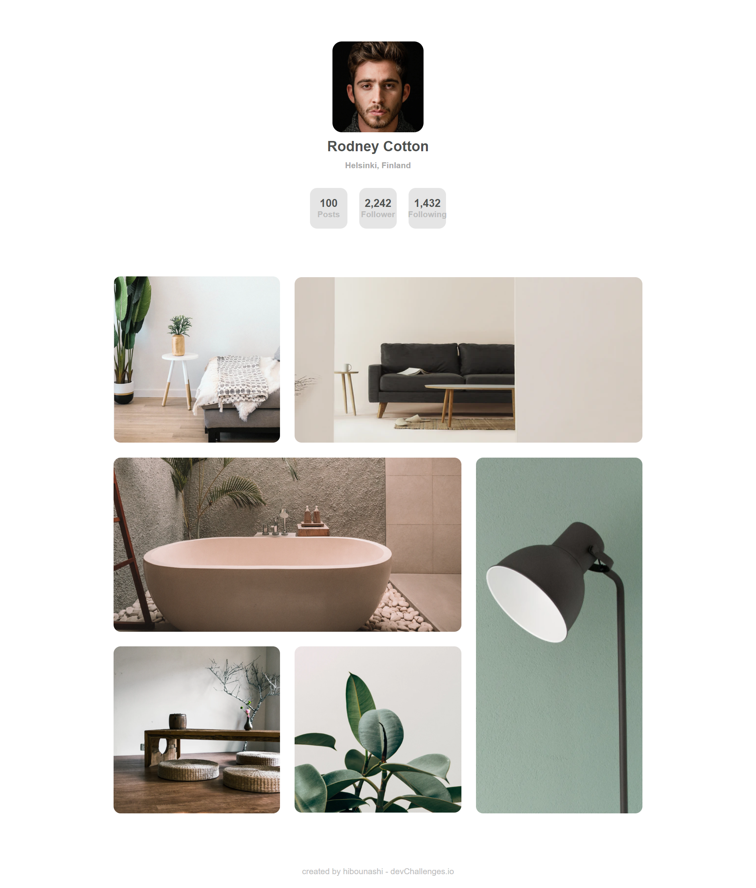

<!-- Please update value in the {}  -->

<h1 align="center">My Gallery page</h1>

   Solution for a challenge from  <a href="http://devchallenges.io" target="_blank">Devchallenges.io</a>.

  <h3>
    <a href="https://o09q4e6uhzwiszzfxbqsaw.on.drv.tw/www.my-gallery-master.blog/">
      Demo
    </a>
     | 
    <a href="https://github.com/hibounashi/my-gallery-master/blob/master/index.html">
      Solution
    </a>
     | 
    <a href="https://devchallenges.io/challenges/gcbWLxG6wdennelX7b8I">
      Challenge
    </a>
  </h3>

<!-- TABLE OF CONTENTS -->

## Table of Contents

- [Overview](#overview)
- [Built With](#built-with)
- [Features](#features)
- [Contact](#contact)
- [Acknowledgements](#acknowledgements)

<!-- OVERVIEW -->

## Overview

this is a web page created by ME using pure HTML and CSS to visualise a social media profile.
if you want to see my demo you can find it all above the page, by creating this page i face many challenges in code like understunding how to use grid , and moreover in the psycho side where i knew how much the consitensy is a key like they say. at the end i discover a new way to host a static web site by using google drive and this will make it 4 ways to host a static website for free.

### Built With

<!-- This section should list any major frameworks that you built your project using. Here are a few examples.-->

- [HTML](https://reactjs.org/)
- [CSS](https://vuejs.org/)

## Features

<!-- List the features of your application or follow the template. Don't share the figma file here :) -->

This application/site was created as a submission to a [DevChallenges](https://devchallenges.io/challenges) challenge. The [challenge](https://devchallenges.io/challenges/gcbWLxG6wdennelX7b8I) was to build an application to complete the given user stories.

## Acknowledgements

<!-- This section should list any articles or add-ons/plugins that helps you to complete the project. This is optional but it will help you in the future. For exmpale -->

- [Steps to replicate a design with only HTML and CSS](https://devchallenges-blogs.web.app/how-to-replicate-design/)
- [W3school](https://www.w3schools.com/css/default.asp)
- [flexboxfroggy](https://flexboxfroggy.com)
- [cssgridgarden](https://cssgridgarden.com)

## Contact

- Website [COMING SOON](https://{your-web-site-link})
- GitHub [@hibounashi](https://github.com/hibounashi)
